# 🧩 MyTriv ERP

<p align="center">
  
  
  
</p>

<p align="center">
  <!-- Odoo Version Badges -->
  
  
  
  
  
  
  
  
  
</p>

<p align="center">
  
  
  
  
  
</p>

<p align="center">
  <strong>Multi-Version Full-Stack ERP Solution</strong><br>
  Compatible with <strong>Odoo 11-19</strong> backend with <strong>Next.js 15</strong> React frontend.<br>
  Designed for <em>enterprise</em> environments with automated CI/CD and Dockerized multi-version support.
</p>

<div align="center">

[📖 Documentation](#-documentation) •
[🚀 Quick Start](#-quick-start) •
[🔧 Features](#-features) •
[🏗️ Multi-Version Support](#-multi-version-support) •
[🤝 Contributing](docs/CONTRIBUTING.md) •
[📚 Module Guide](docs/MODULE_GUIDE.md)

</div>

## ✨ Features

### 🎨 **Modern Frontend**
- ⚡ **Next.js 15** with App Router and Server Components
- 🔷 **TypeScript** for complete type safety
- 🎨 **TailwindCSS** + **shadcn/ui** for beautiful, accessible components
- 📱 **Responsive Design** with mobile-first approach
- 🌙 **Dark Mode** support out of the box

### 🔧 **Multi-Version Backend**
- 🏢 **Odoo 11-19 Community** - Full compatibility across 9 Odoo versions
- 🚀 **Custom REST API** module for seamless integration
- 🐍 **Python 3.8-3.12** with version-specific optimizations
- 📊 **PostgreSQL 15** for enterprise-grade data storage
- 🔒 **Enterprise Security** with role-based access control
- 🔄 **Version Migration Tools** for seamless upgrades

### 🏗️ **Production Ready**
- 🐳 **Docker & Docker Compose** for multi-version deployment
- 🤖 **Automated Setup Script** for one-command installation
- ⚙️ **GitHub Actions** CI/CD pipeline with version matrix testing
- 🚨 **Health Checks** and monitoring across all versions
- 📈 **Scalable Architecture** for enterprise growth
- 🔄 **Hot Reload** development environment
- 🎯 **Multi-Instance Deployment** for testing and staging

### 🔌 **API Integration**
- 📡 **RESTful API** endpoints for all Odoo models
- 🔍 **Advanced Filtering** and search capabilities
- 📤 **Real-time Updates** with automatic UI refresh
- 🛡️ **Error Handling** with user-friendly messages
- 📋 **CRUD Operations** for complete data management

## 🏗️ Multi-Version Support

MyTriv ERP supports **Odoo 11 through Odoo 19**, providing seamless compatibility across 9 major Odoo versions.

### ✅ **Supported Versions**
- **Odoo 11.0** - Legacy support with extended maintenance
- **Odoo 12.0** - Enhanced performance and stability
- **Odoo 13.0** - Modern UI/UX improvements
- **Odoo 14.0** - Advanced reporting capabilities
- **Odoo 15.0** - Improved mobile responsiveness
- **Odoo 16.0** - Enhanced developer experience
- **Odoo 17.0** - Latest stable release (default)
- **Odoo 18.0** - Beta support with early features
- **Odoo 19.0** - Beta support with cutting-edge capabilities

### 🚀 **Version Selection**

#### Quick Start with Default Version (Odoo 17)
```bash
# Uses Odoo 17.0 by default
curl -fsSL https://raw.githubusercontent.com/fxagro/mytriv-erp/main/setup_mytriv_erp.sh | bash
```

#### Specify Odoo Version
```bash
# Set ODOO_VERSION environment variable
export ODOO_VERSION=16.0
curl -fsSL https://raw.githubusercontent.com/fxagro/mytriv-erp/main/setup_mytriv_erp.sh | bash
```

#### Docker Build with Version Argument
```bash
# Build specific Odoo version
docker build --build-arg ODOO_VERSION=15.0 -t mytriv-erp:v15 .

# Run multiple versions simultaneously
docker-compose -f docker-compose.multi-version.yml up -d
```

### 🏭 **Multi-Instance Deployment**

Run multiple Odoo versions simultaneously for testing and migration:

```yaml
# docker-compose.multi-version.yml
services:
  odoo11:
    build:
      context: .
      args:
        ODOO_VERSION: 11.0
    ports:
      - "8011:8069"

  odoo17:
    build:
      context: .
      args:
        ODOO_VERSION: 17.0
    ports:
      - "8017:8069"

  odoo19:
    build:
      context: .
      args:
        ODOO_VERSION: 19.0
    ports:
      - "8019:8069"
```

### 🔄 **Version Migration Strategy**

#### Database Migration
```bash
# 1. Backup current database
docker-compose exec postgres pg_dump -U odoo mytriv_erp > backup_v17.sql

# 2. Deploy new version
export ODOO_VERSION=18.0
docker-compose up -d --build

# 3. Test migration (dry run)
docker-compose exec odoo odoo-bin -u all --test

# 4. Apply migration
docker-compose exec odoo odoo-bin -u all
```

#### Module Compatibility
- **Core modules** compatible across all versions
- **Version-specific features** automatically enabled/disabled
- **Migration scripts** handle data transformations
- **Testing matrix** ensures compatibility

### 🧪 **Testing Matrix**

Every commit triggers automated testing across all supported versions:

```yaml
# .github/workflows/ci-cd.yml
strategy:
  matrix:
    odoo_version: [11.0, 12.0, 13.0, 14.0, 15.0, 16.0, 17.0, 18.0, 19.0]
```

**Test Coverage:**
- ✅ **Unit Tests** - Model and API functionality
- ✅ **Integration Tests** - Cross-module compatibility
- ✅ **Migration Tests** - Version upgrade scenarios
- ✅ **Performance Tests** - Load testing across versions

### 📊 **Version Comparison**

| Version | Release Year | Python | PostgreSQL | Key Features |
|---------|-------------|--------|------------|--------------|
| **Odoo 11** | 2017 | 3.6+ | 9.6+ | Modern UI, IoT |
| **Odoo 12** | 2018 | 3.6+ | 10.0+ | Performance, Studio |
| **Odoo 13** | 2019 | 3.7+ | 11.0+ | Mobile, Reporting |
| **Odoo 14** | 2020 | 3.8+ | 12.0+ | Website, E-commerce |
| **Odoo 15** | 2021 | 3.8+ | 13.0+ | Accounting, Documents |
| **Odoo 16** | 2022 | 3.9+ | 14.0+ | Knowledge, Manufacturing |
| **Odoo 17** | 2023 | 3.10+ | 15.0+ | Dashboard, AI |
| **Odoo 18** | 2024 | 3.11+ | 15.0+ | Advanced Analytics |
| **Odoo 19** | 2025 | 3.12+ | 16.0+ | Next-gen Features |

## 🏛️ Architecture Overview

### **Multi-Version Architecture Diagram**


### **Deployment Architecture**

```mermaid
graph LR
    subgraph "Development Environment"
        subgraph "Local Development"
            LD[💻 Local Machine]
            DV[Docker Compose]
            DBL[(Local PostgreSQL)]
        end

        subgraph "Version Testing"
            VT1[Odoo 11 Test]
            VT2[Odoo 17 Test]
            VT3[Odoo 19 Test]
        end
    end

    subgraph "CI/CD Pipeline"
        GH[GHA Workflow]
        TB[Test Build]
        SB[Staging Build]
        PB[Production Build]
    end

    subgraph "Production Environment"
        subgraph "Multi-Version Production"
            PV1[Odoo 11 Prod]
            PV2[Odoo 17 Prod]
            PV3[Odoo 19 Prod]
        end

        LB[Load Balancer]
        DBP[(Production DB)]
        CDN[CDN]
    end

    %% Development Flow
    LD --> DV
    DV --> DBL
    DV --> VT1
    DV --> VT2
    DV --> VT3

    %% CI/CD Flow
    GH --> TB
    TB --> SB
    SB --> PB

    %% Production Flow
    VT1 --> PV1
    VT2 --> PV2
    VT3 --> PV3

    PV1 --> LB
    PV2 --> LB
    PV3 --> LB

    LB --> DBP
    LB --> CDN

    %% Styling
    classDef dev fill:#e3f2fd,stroke:#1976d2,stroke-width:2px
    classDef cicd fill:#fff3e0,stroke:#f57c00,stroke-width:2px
    classDef prod fill:#e8f5e8,stroke:#388e3c,stroke-width:2px

    class LD,DV,DBL,VT1,VT2,VT3 dev
    class GH,TB,SB,PB cicd
    class PV1,PV2,PV3,LB,DBP,CDN prod
```



## 📋 Table of Contents

- [Quick Start](#quick-start)
- [Automated Setup Details](#automated-setup-details)
- [Manual Setup Guide](#manual-setup-guide)
- [Prerequisites](#prerequisites)
- [Development](#development)
- [API Usage](#api-usage)
- [CI/CD Pipeline](#cicd-pipeline)
- [Project Structure](#project-structure)
- [Documentation](#documentation)
- [Contributing](#contributing)
- [License](#license)

## 🚀 Quick Start

Get MyTriv ERP up and running in **seconds** with one of these options:

### ⚡ One-Line Setup (Recommended)
```bash
curl -fsSL https://raw.githubusercontent.com/fxagro/mytriv-erp/main/setup_mytriv_erp.sh | bash
```

### 🤖 Interactive Setup Script
```bash
# Download the setup script
curl -fsSL https://raw.githubusercontent.com/fxagro/mytriv-erp/main/setup_mytriv_erp.sh -o setup_mytriv_erp.sh
chmod +x setup_mytriv_erp.sh
./setup_mytriv_erp.sh
```

### 📋 Manual Setup (Advanced Users)
```bash
git clone https://github.com/fxagro/mytriv-erp.git
cd mytriv-erp
cp .env.example .env
docker compose up -d
```

### 🌐 **Access Your ERP System**
| Service | URL | Description |
|---------|-----|-------------|
| **Frontend** | http://localhost:3000 | React/Next.js application |
| **Backend** | http://localhost:8069 | Odoo ERP system (v17 default) |
| **Employee API** | http://localhost:8069/api/v1/employees | REST API endpoint |
| **Generic API** | http://localhost:8069/api | All Odoo models API |
| **Database** | localhost:5432 | PostgreSQL admin |

### 🔄 **Multi-Version Access**
| Version | Backend URL | Description |
|---------|-------------|-------------|
| **Odoo 11** | http://localhost:8011 | Legacy version instance |
| **Odoo 12** | http://localhost:8012 | Previous version instance |
| **Odoo 17** | http://localhost:8069 | Default version (recommended) |
| **Odoo 18** | http://localhost:8018 | Latest stable version |
| **Odoo 19** | http://localhost:8019 | Beta version instance |

---

## 🤖 Automated Setup Details

The automated script handles the complete setup process:

### ✅ **What It Does**
- **Clones** repository and initializes Git
- **Validates** Docker and port availability
- **Builds** all containers with health checks
- **Starts** services and verifies they're running
- **Displays** access URLs and helpful commands

### 🎨 **Features**
- **Colored output** with progress indicators
- **Error handling** with cleanup and suggestions
- **Port conflict detection** for smooth installation
- **Pre-flight checks** for all dependencies
- **Automatic GitHub remote configuration**

### 📋 **Requirements**
- **Linux/macOS/WSL** (Windows supported via WSL)
- **Docker & Docker Compose**
- **Git** (for cloning and remote setup)
- **4GB+ RAM** and 10GB+ free disk space
- **Internet connection** (for GitHub operations)

---

## 📥 Manual Setup Guide

For developers who prefer manual control or are on Windows without WSL:

### 📥 **Step 1: Clone & Setup**

#### Option A: Automated Setup (Recommended)
```bash
# Download and run the automated setup script
curl -fsSL https://raw.githubusercontent.com/fxagro/mytriv-erp/main/setup_mytriv_erp.sh -o setup_mytriv_erp.sh
chmod +x setup_mytriv_erp.sh
./setup_mytriv_erp.sh
```

#### Option B: Manual Setup
```bash
git clone https://github.com/fxagro/mytriv-erp.git
cd mytriv-erp
cp .env.example .env
```

### 🐳 **Step 2: Start Services**
```bash
docker-compose up -d
```

### 🌐 **Step 3: Access Application**
| Service | URL | Description |
|---------|-----|-------------|
| **Frontend** | http://localhost:3000 | React application |
| **Backend** | http://localhost:8069 | Odoo ERP system |
| **Employee API** | http://localhost:8069/api/v1/employees | Employee REST API |
| **Generic API** | http://localhost:8069/api | Generic REST API endpoints |
| **Database** | localhost:5432 | PostgreSQL admin |

**That's it! 🎉** Your ERP system is ready!

### 🧪 **Test the API**
```bash
# Get all available models
curl http://localhost:8069/api/models

# Get employees using the dedicated API endpoint
curl http://localhost:8069/api/v1/employees

# Get employees using the generic API (alternative)
curl http://localhost:8069/api/models/hr.employee
```

## 📋 Prerequisites

Before running MyTriv ERP, ensure you have:

- **Docker & Docker Compose** (recommended)
- **Git** for version control
- **At least 4GB RAM** available
- **10GB free disk space** for databases and containers

### System Requirements

| Component | Minimum | Recommended |
|-----------|---------|-------------|
| RAM | 4GB | 8GB |
| CPU | 2 cores | 4 cores |
| Storage | 10GB | 20GB |
| OS | Linux/Windows/macOS | Linux |

## 🔧 Installation

### Option 1: Docker Compose (Recommended)

1. **Clone and navigate:**
   ```bash
   git clone https://github.com/fxagro/mytriv-erp.git
   cd mytriv-erp
   ```

2. **Configure environment:**
   ```bash
   cp .env.example .env
   # Edit .env file with your settings
   ```

3. **Start services:**
   ```bash
   docker-compose up -d
   ```

4. **Verify installation:**
   ```bash
   # Check container status
   docker-compose ps

   # View logs
   docker-compose logs -f odoo
   ```

### Option 2: Manual Installation

#### Frontend Setup

```bash
cd frontend
npm install
npm run build
npm start
```

#### Backend Setup

```bash
cd backend
# Install Odoo dependencies
pip install -r requirements.txt

# Configure Odoo
cp odoo.conf.example odoo.conf
# Edit odoo.conf with your database settings

# Start Odoo
./odoo-bin -c odoo.conf
```

## 💻 Development

### Development Environment

1. **Start development services:**
   ```bash
   docker-compose -f docker-compose.dev.yml up
   ```

2. **Frontend development:**
   ```bash
   cd frontend
   npm run dev
   ```

3. **Backend development:**
   - Access Odoo at http://localhost:8069
   - Enable developer mode for advanced features

### Code Quality

- **Frontend**: ESLint, Prettier, TypeScript
- **Backend**: Python PEP 8, Odoo guidelines
- **Testing**: Jest (frontend), unittest (backend)

Run tests:
```bash
# Frontend tests
cd frontend && npm test

# Backend tests
cd backend && python -m pytest

# All tests
npm run test:all
```

## 🔌 API Usage

MyTriv ERP includes a comprehensive REST API for all Odoo models.

### Basic API Endpoints

```bash
# Get all models (generic API)
GET /api/models

# Get employees (dedicated API endpoint)
GET /api/v1/employees

# Get employees (generic API - alternative)
GET /api/models/hr.employee

# Get specific employee
GET /api/v1/employees/1
# OR
GET /api/models/hr.employee/1

# Create new employee
POST /api/v1/employees
{
  "name": "John Doe",
  "work_email": "john@example.com",
  "job_title": "Software Engineer",
  "work_phone": "+1234567890"
}

# Update employee
PUT /api/v1/employees/1
{
  "work_phone": "+1234567890"
}

# Delete employee
DELETE /api/v1/employees/1
```

### Frontend Integration Example

```typescript
import { employeeService } from '@/services/employeeService';

async function fetchEmployees() {
  try {
    const employees = await employeeService.getEmployees();
    console.log('Employees:', employees);
  } catch (error) {
    console.error('Error fetching employees:', error);
  }
}
```

## 🔄 CI/CD Pipeline

MyTriv ERP includes a comprehensive GitHub Actions workflow that runs on every push and pull request:

### ✅ **Automated Checks**
- **Lint & Validate** - YAML syntax and Docker Compose validation
- **Build & Test** - Container building and startup testing
- **Security Scan** - Vulnerability scanning with Trivy
- **Environment Check** - Required files and configuration validation
- **Notification** - Status reporting and PR comments

### 🔍 **Pipeline Features**
- **Multi-job parallel execution** for faster results
- **Security vulnerability reporting** in GitHub Security tab
- **Automatic PR commenting** with pipeline status
- **Comprehensive error reporting** with actionable feedback
- **Container health verification** before marking as successful

### 🚨 **Security Scanning**
The pipeline includes automated security scanning that:
- Scans all container images for vulnerabilities
- Reports HIGH and CRITICAL severity issues
- Generates SARIF reports for GitHub Security tab
- Provides actionable remediation suggestions

---

## 🚢 Deployment

### Production Deployment

1. **Environment setup:**
   ```bash
   cp .env.example .env.production
   # Configure production settings
   ```

2. **Build and deploy:**
   ```bash
   docker-compose -f docker-compose.production.yml up -d
   ```

3. **Health checks:**
   ```bash
   curl http://your-domain.com/api/v1/employees
   ```

### Environment Variables

Key environment variables for production:

```env
NODE_ENV=production
NEXT_PUBLIC_API_URL=https://your-api-domain.com/api
POSTGRES_PASSWORD=your-secure-password
ODOO_PASSWORD=your-odoo-master-password
```

## 📁 Project Structure

```
mytriv-erp/
├── frontend/              # Next.js 15 React application
│   ├── src/
│   │   ├── app/          # Next.js App Router pages
│   │   ├── components/   # Reusable UI components
│   │   └── lib/          # Utility functions
│   ├── Dockerfile        # Frontend container config
│   └── package.json      # Frontend dependencies
├── backend/              # Odoo 17 backend
│   ├── addons/          # Odoo modules
│   │   └── base_rest_api/ # REST API module
│   ├── Dockerfile       # Backend container config
│   └── requirements.txt # Python dependencies
├── docs/                # Documentation
│   ├── ARCHITECTURE.md  # System architecture
│   ├── CONTRIBUTING.md  # Contribution guidelines
│   └── MODULE_GUIDE.md  # Module development guide
├── .github/            # GitHub configuration
│   └── workflows/      # CI/CD pipelines
├── setup_mytriv_erp.sh # Automated setup script
├── docker-compose.yml  # Development environment
├── .env.example       # Environment configuration template
└── README.md          # This file
```

## 🤝 Contributing

We welcome contributions! Please see our [Contributing Guide](docs/CONTRIBUTING.md) for details.

### How to Contribute

1. **Fork** the repository
2. **Create** a feature branch
3. **Make** your changes
4. **Test** thoroughly
5. **Submit** a pull request

### Development Process

- Follow conventional commit messages
- Write tests for new features
- Update documentation as needed
- Ensure CI/CD checks pass

## 📚 Documentation

### 📖 **Core Documentation**
- **[🏗️ Architecture Guide](docs/ARCHITECTURE.md)**: System design and architecture overview
- **[🔧 Module Development Guide](docs/MODULE_GUIDE.md)**: Creating custom Odoo modules and extensions
- **[🔌 API Documentation](docs/API_DOCUMENTATION.md)**: Complete REST API reference and examples
- **[🚢 Deployment Guide](docs/DEPLOYMENT.md)**: Production deployment and DevOps instructions
- **[⚙️ Multi-Version Setup Guide](docs/SETUP.md)**: Docker setup for different Odoo versions
- **[🔄 Multi-Version Guide](docs/MULTI_VERSION_GUIDE.md)**: Version matrix testing and migration strategies

### 🤝 **Community & Support**
- **[📝 Contributing Guide](docs/CONTRIBUTING.md)**: How to contribute to MyTriv ERP
- **[🐛 Issues](https://github.com/fxagro/mytriv-erp/issues)**: Report bugs and request features
- **[💬 Discussions](https://github.com/fxagro/mytriv-erp/discussions)**: Join community conversations

## 🛠️ Tech Stack

### Frontend
- **Next.js 15** - React framework with App Router
- **TypeScript** - Type-safe JavaScript
- **TailwindCSS** - Utility-first CSS framework
- **shadcn/ui** - Modern UI components
- **Axios** - HTTP client for API calls

### Backend
- **Odoo 17** - Enterprise resource planning framework
- **Python 3.11** - Server-side programming
- **PostgreSQL 15** - Relational database
- **Werkzeug** - WSGI web framework

### DevOps
- **Docker** - Containerization platform
- **Docker Compose** - Multi-container orchestration
- **GitHub Actions** - CI/CD automation
- **Nginx** - Reverse proxy (production)

## 📄 License

This project is licensed under the **MIT License** - see the [LICENSE](LICENSE) file for details.

## 🙏 Acknowledgments

- **Odoo Community** for the excellent ERP framework
- **Next.js Team** for the modern React framework
- **shadcn/ui** for beautiful and accessible UI components
- **Open Source Community** for continuous inspiration and support

## 📞 Support

### Getting Help

- **📖 Documentation**: Check our comprehensive docs
- **🐛 Issues**: Report bugs and request features
- **💬 Discussions**: Join community conversations
- **📧 Email**: Contact the maintainers

### Resources

- [Odoo Documentation](https://www.odoo.com/documentation)
- [Next.js Documentation](https://nextjs.org/docs)
- [React Documentation](https://react.dev)
- [TailwindCSS Documentation](https://tailwindcss.com/docs)

## 🎯 Roadmap

### Upcoming Features

- [ ] **Mobile App**: React Native companion app
- [ ] **Advanced Analytics**: Business intelligence dashboard
- [ ] **Multi-tenancy**: Support for multiple organizations
- [ ] **API Rate Limiting**: Enhanced API security
- [ ] **Real-time Updates**: WebSocket integration
- [ ] **Advanced Reporting**: Custom report builder

### Version History

- **v1.0.0**: Initial release with core ERP functionality
- **v0.1.0**: Pre-release with basic setup and API

## 🌐 Repository

**🔗 GitHub:** `https://github.com/fxagro/mytriv-erp.git`

---

<div align="center">

## 🤝 Contributing

We welcome contributions from developers of all skill levels!

### 🚀 **Getting Started**
1. **Fork** the repository
2. **Create** a feature branch
3. **Make** your changes
4. **Submit** a pull request

### 📚 **Resources**
- 📖 **[Contribution Guide](docs/CONTRIBUTING.md)**
- 🏗️ **[Module Development](docs/MODULE_GUIDE.md)**
- 🏛️ **[Architecture Guide](docs/ARCHITECTURE.md)**

### 💬 **Community**
- 🐛 **[Report Issues](https://github.com/fxagro/mytriv-erp/issues)**
- 💭 **[Discussions](https://github.com/fxagro/mytriv-erp/discussions)**
- 📧 **Email:** [your-email@mytriv.com](mailto:contact@mytriv.com)

---

**⭐ Star us on GitHub • 🐛 Report Issues • 📖 Read Documentation**

**Built with ❤️ for modern businesses | MyTriv ERP - Open Source ERP Solution**

</div>