📦 MyTriv ERP (Archived)

Status: Archived / Reference Project

This repository represents an earlier system-level exploration into business process automation and ERP architecture.
It is no longer an active product, but serves as a reference project demonstrating experience in building complex, system-grade applications.

🧠 Project Context

The MyTriv ERP project was developed to explore and understand:

Business workflow modeling

Role-based access control (RBAC)

Data consistency across complex entities

Backend system architecture for business applications

Many of the architectural lessons from this project later influenced the design decisions behind the MyTriv ecosystem, particularly in areas such as system modularity, scalability, and long-term maintainability.

🔧 What I Learned Building This

Designing and implementing multi-role business workflows

Managing complex relational data structures

Structuring backend services for long-term scalability

Translating real-world business processes into software systems

This project reflects a hands-on, system-oriented approach rather than a tutorial or proof-of-concept.

📁 Project Scope

This repository is shared publicly for learning and reference purposes only.

❌ Not an active product

❌ Not under active development

❌ Not intended for production use

🚀 Current Work

I am currently building the MyTriv AI Ecosystem, an AI-native platform focused on education, agentic systems, and cloud-based learning infrastructure.

🌐 https://mytriv.com

💬 https://chat.mytriv.com

Selected system components and architectural patterns from current projects are being prepared for open-source release.

📜 License

This project is provided for educational and reference use.
Please refer to the LICENSE file for detailed licensing information.

👤 Author

Agus Rochman
Founder – MyTriv
Building AI-native learning platforms & agentic systems


# 🧩 MyTriv ERP Cloud

<p align="center">
  
</p>

<p align="center">
  
  
  
  
</p>

<p align="center">
  <!-- Odoo Version Badges -->
  
  
  
  
  
  
  
  
  
</p>

<p align="center">
  
  
  
  
  
</p>

<p align="center">
  <strong>Cloud-Native Modular ERP Platform</strong><br>
  Open-Core ERP solution with <strong>Odoo 11-19</strong> compatibility and <strong>Next.js 15</strong> frontend.<br>
  Built for <em>modern enterprises</em> with cloud deployment, multi-tenancy, and enterprise monetization.
</p>

<div align="center">

[📖 Documentation](#-documentation) •
[🚀 Quick Start](#-quick-start) •
[🔧 Features](#-features) •
[🏗️ Multi-Version Support](#-multi-version-support) •
[💰 Enterprise Plan](#-enterprise--monetization-plan) •
[🤝 Contributing](docs/CONTRIBUTING.md) •
[📚 Module Guide](docs/MODULE_GUIDE.md)

</div>

---

## 📋 Table of Contents

- [Overview](#overview)
- [Key Features](#key-features)
- [System Architecture](#system-architecture)
- [Multi-Version Odoo Compatibility](#multi-version-odoo-compatibility-11–19)
- [Quick Start (Docker)](#quick-start-docker)
- [Development Guide](#development-guide)
- [Enterprise & Monetization Plan](#enterprise--monetization-plan)
- [License](#license)

---

## Overview

### English

MyTriv ERP Cloud is a modern, cloud-native Enterprise Resource Planning (ERP) platform built on the Odoo framework with a React/Next.js frontend. It offers a modular architecture that supports multiple Odoo versions (11-19) simultaneously, making it ideal for enterprises requiring version flexibility, testing capabilities, and gradual migration strategies.

The platform follows an **open-core model** with free community features and premium enterprise extensions, designed for cloud deployment with multi-tenancy support and comprehensive monetization capabilities.

### Indonesian (Bahasa Indonesia)

MyTriv ERP Cloud adalah platform Enterprise Resource Planning (ERP) modern dan cloud-native yang dibangun di atas kerangka kerja Odoo dengan frontend React/Next.js. Platform ini menawarkan arsitektur modular yang mendukung beberapa versi Odoo (11-19) secara bersamaan, menjadikannya ideal untuk perusahaan yang memerlukan fleksibilitas versi, kemampuan pengujian, dan strategi migrasi bertahap.

Platform ini mengikuti **model open-core** dengan fitur komunitas gratis dan ekstensi enterprise premium, dirancang untuk deployment cloud dengan dukungan multi-tenancy dan kemampuan monetisasi yang komprehensif.

---

## Key Features

### English

#### 🎨 **Modern Frontend**
- ⚡ **Next.js 15** with App Router and Server Components
- 🔷 **TypeScript** for complete type safety
- 🎨 **TailwindCSS** + **shadcn/ui** for beautiful, accessible components
- 📱 **Responsive Design** with mobile-first approach
- 🌙 **Dark Mode** support out of the box

#### 🔧 **Multi-Version Backend**
- 🏢 **Odoo 11-19 Community** - Full compatibility across 9 Odoo versions
- 🚀 **Custom REST API** module for seamless integration
- 🐍 **Python 3.8-3.12** with version-specific optimizations
- 📊 **PostgreSQL 15** for enterprise-grade data storage
- 🔒 **Enterprise Security** with role-based access control
- 🔄 **Version Migration Tools** for seamless upgrades

#### ☁️ **Cloud-Native Architecture**
- 🐳 **Docker & Kubernetes** ready for cloud deployment
- 🔄 **Multi-tenancy** support for SaaS deployments
- 📈 **Horizontal scaling** across multiple instances
- 🚨 **Comprehensive monitoring** and alerting
- 🔒 **Enterprise-grade security** with compliance features

#### 💰 **Monetization Ready**
- 🆓 **Open-Core Model** - Free community + premium features
- 👥 **Multi-tenant SaaS** architecture
- 💳 **Subscription management** and billing integration
- 🛒 **Marketplace** for custom modules and extensions
- 📊 **Usage analytics** and reporting

### Indonesian (Bahasa Indonesia)

#### 🎨 **Frontend Modern**
- ⚡ **Next.js 15** dengan App Router dan Server Components
- 🔷 **TypeScript** untuk keamanan tipe yang lengkap
- 🎨 **TailwindCSS** + **shadcn/ui** untuk komponen yang indah dan dapat diakses
- 📱 **Desain Responsif** dengan pendekatan mobile-first
- 🌙 **Dukungan Dark Mode** langsung dari kotak

#### 🔧 **Backend Multi-Versi**
- 🏢 **Odoo 11-19 Community** - Kompatibilitas penuh di 9 versi Odoo
- 🚀 **Modul REST API** khusus untuk integrasi yang mulus
- 🐍 **Python 3.8-3.12** dengan optimasi khusus versi
- 📊 **PostgreSQL 15** untuk penyimpanan data kelas enterprise
- 🔒 **Keamanan Enterprise** dengan kontrol akses berbasis peran
- 🔄 **Tools Migrasi Versi** untuk upgrade yang mulus

#### ☁️ **Arsitektur Cloud-Native**
- 🐳 **Docker & Kubernetes** siap untuk deployment cloud
- 🔄 **Dukungan Multi-tenancy** untuk deployment SaaS
- 📈 **Penskalaan horizontal** di beberapa instance
- 🚨 **Pemantauan komprehensif** dan alerting
- 🔒 **Keamanan kelas enterprise** dengan fitur kepatuhan

#### 💰 **Siap Monetisasi**
- 🆓 **Model Open-Core** - Komunitas gratis + fitur premium
- 👥 **Arsitektur Multi-tenant SaaS**
- 💳 **Manajemen langganan** dan integrasi penagihan
- 🛒 **Marketplace** untuk modul dan ekstensi khusus
- 📊 **Analitik penggunaan** dan pelaporan

---

## System Architecture

### English

MyTriv ERP Cloud employs a modern, scalable architecture designed for cloud deployment and multi-tenancy. The system is built with microservices principles while maintaining Odoo's modular approach.

### Indonesian (Bahasa Indonesia)

MyTriv ERP Cloud menggunakan arsitektur modern dan skalabel yang dirancang untuk deployment cloud dan multi-tenancy. Sistem ini dibangun dengan prinsip microservices sambil mempertahankan pendekatan modular Odoo.

```mermaid
graph TB
    subgraph "🌐 User Layer"
        U[👤 Users]
        M[📱 Mobile Apps]
        T[🖥️ Third-party Systems]
    end

    subgraph "☁️ Cloud Platform"
        subgraph "🚀 Load Balancer & API Gateway"
            LB[Load Balancer]
            GW[API Gateway]
            AUTH[Authentication Service]
        end

        subgraph "🔧 Application Layer"
            subgraph "⚛️ Frontend Services"
                F[Next.js 15 App]
                S[shadcn/ui Components]
                A[API Client]
            end

            subgraph "🔧 Backend Services"
                O11[Odoo 11 Instance]
                O17[Odoo 17 Instance]
                O19[Odoo 19 Instance]
                R[base_rest_api Module]
            end
        end

        subgraph "💾 Data Layer"
            P[(PostgreSQL Cluster)]
            RD[(Redis Cluster)]
            FS[(File Storage)]
        end
    end

    %% Connections
    U --> LB
    M --> LB
    T --> GW

    LB --> F
    GW --> R

    F --> R
    A --> R

    R --> O11
    R --> O17
    R --> O19

    O11 --> P
    O17 --> P
    O19 --> P

    AUTH --> P
    AUTH --> RD
```



---

## Multi-Version Odoo Compatibility (11–19)

### English

MyTriv ERP Cloud provides seamless compatibility across **9 Odoo versions**, allowing enterprises to run multiple versions simultaneously for testing, migration, and gradual rollout strategies.

#### Supported Versions Matrix

| Version | Status | Python | Key Features | Use Case |
|---------|--------|--------|--------------|----------|
| **Odoo 11** | Legacy | 3.6+ | Modern UI, IoT | Legacy system support |
| **Odoo 12** | Stable | 3.6+ | Performance, Studio | Production deployments |
| **Odoo 13** | Stable | 3.7+ | Mobile, Reporting | Mobile-first businesses |
| **Odoo 14** | Stable | 3.8+ | Website, E-commerce | Online businesses |
| **Odoo 15** | Stable | 3.8+ | Accounting, Documents | Finance-focused |
| **Odoo 16** | Stable | 3.9+ | Knowledge, Manufacturing | Manufacturing |
| **Odoo 17** | **Default** | 3.10+ | Dashboard, AI | Recommended |
| **Odoo 18** | Beta | 3.11+ | Advanced Analytics | Early adopters |
| **Odoo 19** | Beta | 3.12+ | Next-gen Features | Innovation testing |

### Indonesian (Bahasa Indonesia)

MyTriv ERP Cloud menyediakan kompatibilitas yang mulus di **9 versi Odoo**, memungkinkan perusahaan untuk menjalankan beberapa versi secara bersamaan untuk pengujian, migrasi, dan strategi peluncuran bertahap.

#### Matriks Versi yang Didukung

| Versi | Status | Python | Fitur Utama | Kasus Penggunaan |
|-------|--------|--------|-------------|------------------|
| **Odoo 11** | Legacy | 3.6+ | UI Modern, IoT | Dukungan sistem legacy |
| **Odoo 12** | Stabil | 3.6+ | Performa, Studio | Deployment produksi |
| **Odoo 13** | Stabil | 3.7+ | Mobile, Pelaporan | Bisnis mobile-first |
| **Odoo 14** | Stabil | 3.8+ | Website, E-commerce | Bisnis online |
| **Odoo 15** | Stabil | 3.8+ | Akuntansi, Dokumen | Berfokus pada keuangan |
| **Odoo 16** | Stabil | 3.9+ | Pengetahuan, Manufaktur | Manufaktur |
| **Odoo 17** | **Default** | 3.10+ | Dashboard, AI | Direkomendasikan |
| **Odoo 18** | Beta | 3.11+ | Analitik Lanjutan | Early adopters |
| **Odoo 19** | Beta | 3.12+ | Fitur Next-gen | Pengujian inovasi |

---

## Quick Start (Docker)

### English

Get started with MyTriv ERP Cloud in minutes using Docker:

#### One-Command Setup
```bash
# Uses Odoo 17.0 by default
curl -fsSL https://raw.githubusercontent.com/fxagro/mytriv-erp/main/setup_mytriv_erp.sh | bash
```

#### Manual Docker Setup
```bash
# Clone repository
git clone https://github.com/fxagro/mytriv-erp.git
cd mytriv-erp

# Configure environment
cp .env.example .env

# Start all services
docker-compose up -d
```

#### Access Points
| Service | URL | Description |
|---------|-----|-------------|
| **Frontend** | http://localhost:3000 | React/Next.js application |
| **Backend** | http://localhost:8069 | Odoo ERP system (v17 default) |
| **API** | http://localhost:8069/api | REST API endpoints |

### Indonesian (Bahasa Indonesia)

Mulai dengan MyTriv ERP Cloud dalam hitungan menit menggunakan Docker:

#### Setup Satu Perintah
```bash
# Menggunakan Odoo 17.0 secara default
curl -fsSL https://raw.githubusercontent.com/fxagro/mytriv-erp/main/setup_mytriv_erp.sh | bash
```

#### Setup Docker Manual
```bash
# Clone repository
git clone https://github.com/fxagro/mytriv-erp.git
cd mytriv-erp

# Konfigurasi environment
cp .env.example .env

# Start semua layanan
docker-compose up -d
```

#### Titik Akses
| Layanan | URL | Deskripsi |
|---------|-----|-----------|
| **Frontend** | http://localhost:3000 | Aplikasi React/Next.js |
| **Backend** | http://localhost:8069 | Sistem ERP Odoo (v17 default) |
| **API** | http://localhost:8069/api | Endpoint REST API |

---

## Development Guide

### English

#### Prerequisites
- **Docker & Docker Compose**
- **Node.js 18+** (for local frontend development)
- **Python 3.10+** (for local backend development)
- **Git** for version control

#### Local Development Setup
```bash
# 1. Clone and setup
git clone https://github.com/fxagro/mytriv-erp.git
cd mytriv-erp
cp .env.example .env

# 2. Start backend services
docker-compose up -d postgres redis

# 3. Setup frontend (local development)
cd frontend
npm install
npm run dev

# 4. Setup backend (local development)
cd backend
pip install -r requirements.txt
./odoo-bin -c odoo.conf --dev=all
```

### Indonesian (Bahasa Indonesia)

#### Prasyarat
- **Docker & Docker Compose**
- **Node.js 18+** (untuk pengembangan frontend lokal)
- **Python 3.10+** (untuk pengembangan backend lokal)
- **Git** untuk kontrol versi

#### Setup Pengembangan Lokal
```bash
# 1. Clone dan setup
git clone https://github.com/fxagro/mytriv-erp.git
cd mytriv-erp
cp .env.example .env

# 2. Start layanan backend
docker-compose up -d postgres redis

# 3. Setup frontend (pengembangan lokal)
cd frontend
npm install
npm run dev

# 4. Setup backend (pengembangan lokal)
cd backend
pip install -r requirements.txt
./odoo-bin -c odoo.conf --dev=all
```

---

## Enterprise & Monetization Plan

### English

MyTriv ERP Cloud implements a comprehensive **open-core monetization strategy** designed for sustainable business growth while maintaining strong community engagement.

#### Open-Core Model
- **🆓 Community Edition**: Full ERP functionality with Odoo 11-19 support
- **💰 Enterprise Edition**: Premium features, dedicated support, and advanced integrations
- **🔧 Custom Development**: Bespoke module development and consulting services

#### SaaS Monetization Tiers

| Tier | Monthly Price | Features | Target Market |
|------|---------------|----------|---------------|
| **Starter** | $x/user | Basic ERP, 1 Odoo version | Small businesses |
| **Professional** | $xx/user | Multi-version, API access | Growing companies |
| **Enterprise** | $xxx/user | Custom modules, priority support | Large enterprises |
| **Custom** | Quote-based | Full customization, on-premise | Enterprise clients |

#### Revenue Streams
1. **SaaS Subscriptions** - Recurring revenue from cloud deployments
2. **Custom Module Marketplace** - Commission from third-party modules
3. **Enterprise Support** - SLA-based support contracts
4. **Consulting Services** - Implementation and customization services
5. **Partner Program** - Revenue sharing with implementation partners

### Indonesian (Bahasa Indonesia)

MyTriv ERP Cloud menerapkan strategi monetisasi **open-core** yang komprehensif yang dirancang untuk pertumbuhan bisnis yang berkelanjutan sambil mempertahankan keterlibatan komunitas yang kuat.

#### Model Open-Core
- **🆓 Edisi Komunitas**: Fungsi ERP lengkap dengan dukungan Odoo 11-19
- **💰 Edisi Enterprise**: Fitur premium, dukungan dedicated, dan integrasi lanjutan
- **🔧 Pengembangan Khusus**: Pengembangan modul bespoke dan layanan konsultasi

#### Tingkatan Monetisasi SaaS

| Tingkat | Harga Bulanan | Fitur | Pasar Sasaran |
|---------|---------------|-------|---------------|
| **Starter** | $x/user | ERP dasar, 1 versi Odoo | Bisnis kecil |
| **Professional** | $xx/user | Multi-versi, akses API | Perusahaan berkembang |
| **Enterprise** | $xxx/user | Modul khusus, dukungan prioritas | Perusahaan besar |
| **Custom** | Berbasis kuota | Kustomisasi penuh, on-premise | Klien enterprise |

#### Aliran Pendapatan
1. **Langganan SaaS** - Pendapatan berulang dari deployment cloud
2. **Marketplace Modul Khusus** - Komisi dari modul pihak ketiga
3. **Dukungan Enterprise** - Kontrak dukungan berbasis SLA
4. **Layanan Konsultasi** - Layanan implementasi dan kustomisasi
5. **Program Partner** - Pembagian pendapatan dengan partner implementasi |

---

## License

### English

MyTriv ERP Cloud is released under the **MIT License** for the core platform, with the following structure:

- **Open Source Core**: MIT License - Free for personal and commercial use
- **Enterprise Extensions**: Proprietary License - Commercial use requires subscription
- **Custom Modules**: Varies by module license (MIT, Proprietary, or Custom)

### Indonesian (Bahasa Indonesia)

MyTriv ERP Cloud dirilis di bawah **Lisensi MIT** untuk platform inti, dengan struktur sebagai berikut:

- **Core Open Source**: Lisensi MIT - Gratis untuk penggunaan pribadi dan komersial
- **Ekstensi Enterprise**: Lisensi Proprietary - Penggunaan komersial memerlukan langganan
- **Modul Khusus**: Bervariasi menurut lisensi modul (MIT, Proprietary, atau Custom)

---

<div align="center">

## 🤝 Contributing

We welcome contributions from developers of all skill levels!

### 🚀 **Getting Started**
1. **Fork** the repository
2. **Create** a feature branch
3. **Make** your changes
4. **Submit** a pull request

### 📚 **Resources**
- 📖 **[Setup Guide](docs/SETUP.md)**
- 🏗️ **[Multi-Version Guide](docs/MULTI_VERSION_GUIDE.md)**
- 🚢 **[Deployment Guide](docs/DEPLOYMENT.md)**
- 💰 **[Enterprise Plan](docs/ENTERPRISE_PLAN.md)**

### 💬 **Community**
- 🐛 **[Report Issues](https://github.com/fxagro/mytriv-erp/issues)**
- 💭 **[Discussions](https://github.com/fxagro/mytriv-erp/discussions)**
- 📧 **Email:** [contact@mytriv.com](mailto:contact@mytriv.com)

---

**⭐ Star us on GitHub • 🐛 Report Issues • 📖 Read Documentation**

**Built with ❤️ for modern businesses | MyTriv ERP Cloud - Open-Core ERP Platform**

</div>
