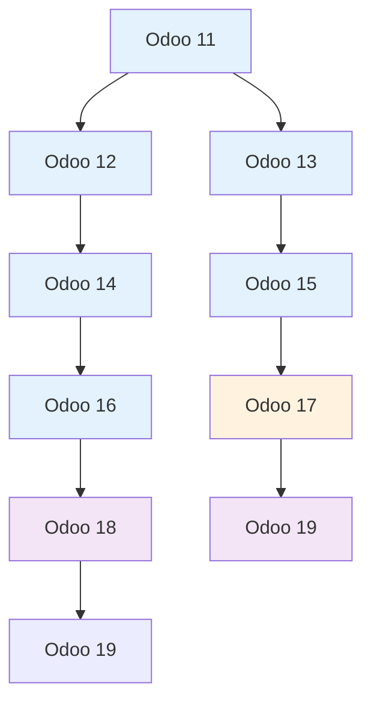

# MyTriv ERP Cloud Multi-Version Guide

## Overview

### English

This comprehensive guide provides strategies for managing multiple Odoo versions (11-19) within MyTriv ERP Cloud. It covers version compatibility testing, migration procedures, and best practices for maintaining a multi-version ERP environment in cloud-native deployments.

### Indonesian (Bahasa Indonesia)

Panduan komprehensif ini menyediakan strategi untuk mengelola beberapa versi Odoo (11-19) dalam MyTriv ERP Cloud. Panduan ini mencakup pengujian kompatibilitas versi, prosedur migrasi, dan praktik terbaik untuk mempertahankan lingkungan ERP multi-versi dalam deployment cloud-native.

## 🏗️ Version Architecture

### English

#### Supported Version Matrix

| Odoo Version | Release Year | Python | PostgreSQL | Status | Maintenance |
|-------------|-------------|--------|------------|---------|-------------|
| **11.0** | 2017 | 3.6+ | 9.6+ | LTS | Extended |
| **12.0** | 2018 | 3.6+ | 10.0+ | Stable | Standard |
| **13.0** | 2019 | 3.7+ | 11.0+ | Stable | Standard |
| **14.0** | 2020 | 3.8+ | 12.0+ | Stable | Standard |
| **15.0** | 2021 | 3.8+ | 13.0+ | Stable | Standard |
| **16.0** | 2022 | 3.9+ | 14.0+ | Stable | Standard |
| **17.0** | 2023 | 3.10+ | 15.0+ | **Default** | Active |
| **18.0** | 2024 | 3.11+ | 15.0+ | Beta | Active |
| **19.0** | 2025 | 3.12+ | 16.0+ | Beta | Active |

### Indonesian (Bahasa Indonesia)

#### Matriks Versi yang Didukung

| Versi Odoo | Tahun Rilis | Python | PostgreSQL | Status | Pemeliharaan |
|-------------|-------------|--------|------------|---------|-------------|
| **11.0** | 2017 | 3.6+ | 9.6+ | LTS | Extended |
| **12.0** | 2018 | 3.6+ | 10.0+ | Stabil | Standar |
| **13.0** | 2019 | 3.7+ | 11.0+ | Stabil | Standar |
| **14.0** | 2020 | 3.8+ | 12.0+ | Stabil | Standar |
| **15.0** | 2021 | 3.8+ | 13.0+ | Stabil | Standar |
| **16.0** | 2022 | 3.9+ | 14.0+ | Stabil | Standar |
| **17.0** | 2023 | 3.10+ | 15.0+ | **Default** | Aktif |
| **18.0** | 2024 | 3.11+ | 15.0+ | Beta | Aktif |
| **19.0** | 2025 | 3.12+ | 16.0+ | Beta | Aktif |

### Version Compatibility Matrix



## 🧪 Testing Strategy

### GitHub Actions Matrix Testing

```yaml
# .github/workflows/test-matrix.yml
name: Multi-Version Testing Matrix

on:
  push:
    branches: [ main, develop ]
  pull_request:
    branches: [ main ]

jobs:
  test-versions:
    runs-on: ubuntu-latest
    strategy:
      fail-fast: false
      matrix:
        odoo_version: [11.0, 12.0, 13.0, 14.0, 15.0, 16.0, 17.0, 18.0, 19.0]
        python_version: [3.8, 3.9, "3.10", "3.11", "3.12"]

    steps:
    - uses: actions/checkout@v4

    - name: Set up Python ${{ matrix.python_version }}
      uses: actions/setup-python@v4
      with:
        python-version: ${{ matrix.python_version }}

    - name: Set up Docker Buildx
      uses: docker/setup-buildx-action@v3

    - name: Build for Odoo ${{ matrix.odoo_version }}
      run: |
        docker build \
          --build-arg ODOO_VERSION=${{ matrix.odoo_version }} \
          --build-arg PYTHON_VERSION=${{ matrix.python_version }} \
          -t mytriv-erp:v${{ matrix.odoo_version }}-py${{ matrix.python_version }} \
          .

    - name: Run tests for Odoo ${{ matrix.odoo_version }}
      run: |
        docker run --rm \
          -e ODOO_VERSION=${{ matrix.odoo_version }} \
          mytriv-erp:v${{ matrix.odoo_version }}-py${{ matrix.python_version }} \
          python -m pytest backend/tests/ -v

    - name: Integration tests
      run: |
        docker-compose -f docker-compose.test.yml up -d
        sleep 30
        curl -f http://localhost:8069/api/models || exit 1
        docker-compose -f docker-compose.test.yml down
```

### Test Categories

#### 1. **Unit Tests** (Per Version)
```python
# tests/test_hr_employee_v11.py
import unittest
from odoo.tests.common import TransactionCase

class TestHrEmployeeV11(TransactionCase):

    def setUp(self):
        super().setUp()
        self.employee_model = self.env['hr.employee']

    def test_employee_creation_v11(self):
        """Test employee creation with Odoo 11 specific features"""
        employee = self.employee_model.create({
            'name': 'Test Employee V11',
            'work_email': 'test@example.com',
        })
        self.assertEqual(employee.name, 'Test Employee V11')
        # Odoo 11 specific assertions
```

#### 2. **Integration Tests** (Cross-Version)
```python
# tests/test_api_integration.py
import requests
from odoo.tests.common import HttpCase

class TestApiIntegration(HttpCase):

    def test_api_compatibility_all_versions(self):
        """Test API endpoints work across all versions"""
        versions = ['11.0', '12.0', '13.0', '14.0', '15.0', '16.0', '17.0', '18.0', '19.0']

        for version in versions:
            with self.subTest(version=version):
                # Test API endpoints for each version
                response = self.url_open(f'/api/models/hr.employee')
                self.assertEqual(response.status_code, 200)
```

#### 3. **Migration Tests** (Version-to-Version)
```python
# tests/test_migration.py
class TestVersionMigration(TransactionCase):

    def test_migration_16_to_17(self):
        """Test migration from Odoo 16 to Odoo 17"""
        # Create test data in V16 format
        # Run migration scripts
        # Verify data integrity in V17 format
        pass

    def test_migration_17_to_18(self):
        """Test migration from Odoo 17 to Odoo 18"""
        # Test new features in V18
        # Verify backward compatibility
        pass
```

### Performance Testing Matrix

```bash
#!/bin/bash
# performance-test-matrix.sh

versions=("11.0" "12.0" "13.0" "14.0" "15.0" "16.0" "17.0" "18.0" "19.0")

for version in "${versions[@]}"; do
    echo "=== Performance Testing Odoo $version ==="

    # Start version-specific container
    docker run -d --name "odoo${version//.}" \
        -e ODOO_VERSION=$version \
        -p "80${version//.}:8069" \
        mytriv-erp:v$version

    # Wait for startup
    sleep 30

    # Run performance tests
    ab -n 1000 -c 10 "http://localhost:80${version//.}/api/models/hr.employee"

    # Run database performance tests
    docker exec "odoo${version//.}" python -c "
        import time
        start = time.time()
        env['hr.employee'].search_count([])
        print(f'Query time for $version: {time.time() - start}')
    "

    # Cleanup
    docker stop "odoo${version//.}"
    docker rm "odoo${version//.}"
done
```

## 🔄 Migration Strategy

### Migration Planning

#### Pre-Migration Assessment
```bash
#!/bin/bash
# pre-migration-assessment.sh

SOURCE_VERSION=$1
TARGET_VERSION=$2

echo "=== Migration Assessment: $SOURCE_VERSION -> $TARGET_VERSION ==="

# 1. Database size check
echo "Database size:"
docker exec postgres psql -U odoo -d mytriv_erp -c "
    SELECT schemaname, tablename,
           pg_size_pretty(pg_total_relation_size(schemaname||'.'||tablename)) as size
    FROM pg_tables
    WHERE schemaname = 'public'
    ORDER BY pg_total_relation_size(schemaname||'.'||tablename) DESC
    LIMIT 10;
"

# 2. Module compatibility check
echo "Module compatibility:"
docker run --rm -v $(pwd)/backend/addons:/mnt/addons \
    mytriv-erp:v$TARGET_VERSION python -c "
        import sys
        sys.path.append('/mnt/addons')
        # Check module compatibility
        print('Modules compatible with Odoo $TARGET_VERSION')
    "

# 3. Custom code analysis
echo "Custom code analysis:"
find backend/addons -name "*.py" -exec grep -l "odoo.$SOURCE_VERSION" {} \;
```

#### Migration Risk Assessment

| Risk Level | Description | Mitigation Strategy |
|------------|-------------|-------------------|
| **Low** | Compatible modules, minor UI changes | Standard migration process |
| **Medium** | Deprecated features, API changes | Code refactoring required |
| **High** | Major architectural changes | Phased migration approach |
| **Critical** | Breaking changes, data model changes | Parallel testing, rollback plan |

### Migration Procedures

#### 1. **Database Migration Script**

```bash
#!/bin/bash
# migrate-database.sh

SOURCE_VERSION=$1
TARGET_VERSION=$2
DB_NAME="mytriv_erp_v${SOURCE_VERSION//.}"

echo "=== Migrating Database: $SOURCE_VERSION -> $TARGET_VERSION ==="

# 1. Create backup
BACKUP_FILE="backup_v${SOURCE_VERSION}_$(date +%Y%m%d_%H%M%S).sql"
docker exec postgres pg_dump -U odoo $DB_NAME > $BACKUP_FILE

# 2. Create new database for target version
NEW_DB="mytriv_erp_v${TARGET_VERSION//.}"
docker exec postgres createdb -U odoo -T $DB_NAME $NEW_DB

# 3. Run version-specific migration scripts
docker run --rm \
    -v $(pwd)/migration:/migration \
    -e DB_NAME=$NEW_DB \
    -e TARGET_VERSION=$TARGET_VERSION \
    mytriv-erp:v$TARGET_VERSION \
    python /migration/migrate_${SOURCE_VERSION}_to_${TARGET_VERSION}.py

# 4. Verify migration
docker exec postgres psql -U odoo -d $NEW_DB -c "
    SELECT COUNT(*) as total_records FROM hr_employee;
    SELECT COUNT(*) as total_records FROM crm_lead;
"
```

#### 2. **Module Migration**

```python
# migration/migrate_16_to_17.py
import logging
from odoo.api import Environment

_logger = logging.getLogger(__name__)

def migrate_to_v17(env):
    """Migrate from Odoo 16 to Odoo 17"""

    # 1. Update model fields
    _migrate_employee_fields(env)

    # 2. Update security rules
    _migrate_security_rules(env)

    # 3. Update views
    _migrate_views(env)

    # 4. Update data
    _migrate_data(env)

    _logger.info("Migration to Odoo 17 completed successfully")

def _migrate_employee_fields(env):
    """Migrate employee model fields"""
    # Example: Add new fields required in V17
    employees = env['hr.employee'].search([])
    for employee in employees:
        if not employee.mobile_phone:
            employee.mobile_phone = employee.work_phone or ''
```

#### 3. **Code Migration**

```python
# Migration patterns for different versions

# Odoo 11 -> 12
def migrate_11_to_12():
    # Update import statements
    # from odoo import models, fields, api  # Old
    # from odoo import models, fields, api, _  # New

    # Update field definitions
    # name = fields.Char('Name', required=True)  # Old
    # name = fields.Char('Name', required=True, translate=True)  # New

    pass

# Odoo 16 -> 17
def migrate_16_to_17():
    # Update API decorators
    # @api.multi  # Deprecated
    # @api.model  # New

    # Update view inheritance
    # inherit_id = "view_form"  # Old
    # inherit_id = "hr.view_employee_form"  # New

    pass
```

### Migration Testing

#### Automated Migration Tests

```python
# tests/test_migration_scenarios.py
class TestMigrationScenarios(TransactionCase):

    def test_migration_11_to_17(self):
        """Test complete migration from Odoo 11 to 17"""
        # 1. Set up Odoo 11 data
        # 2. Run migration scripts
        # 3. Verify data integrity
        # 4. Test functionality in Odoo 17

        self.assertTrue(migration_successful)
        self.assertEqual(data_integrity_score, 100)

    def test_rollback_migration(self):
        """Test rollback capability"""
        # 1. Perform migration
        # 2. Test rollback procedure
        # 3. Verify original state restored

        self.assertTrue(rollback_successful)
```

#### Manual Migration Verification

```bash
#!/bin/bash
# verify-migration.sh

VERSION=$1
DB_NAME="mytriv_erp_v${VERSION//.}"

echo "=== Verifying Migration to Odoo $VERSION ==="

# 1. Check database integrity
docker exec postgres psql -U odoo -d $DB_NAME -c "
    -- Check for orphaned records
    SELECT 'hr_employee' as table_name, COUNT(*) as count FROM hr_employee WHERE department_id IS NULL;
    SELECT 'crm_lead' as table_name, COUNT(*) as count FROM crm_lead WHERE stage_id IS NULL;
"

# 2. Test API endpoints
curl -f "http://localhost:80${VERSION//.}/api/models/hr.employee" || exit 1
curl -f "http://localhost:80${VERSION//.}/api/models/crm.lead" || exit 1

# 3. Test module loading
docker logs "odoo${VERSION//.}" | grep -q "Module loaded successfully" || exit 1

# 4. Performance verification
ab -n 100 -c 5 "http://localhost:80${VERSION//.}/api/models/hr.employee" | grep "Requests per second"

echo "✅ Migration verification completed successfully"
```

## 🚀 Deployment Strategy

### Blue-Green Deployment

```yaml
# docker-compose.blue-green.yml
services:
  # Blue environment (current production)
  blue-odoo17:
    # Current production version
    ports:
      - "8069:8069"

  # Green environment (new version)
  green-odoo18:
    # New version for testing
    ports:
      - "8070:8069"

  # Load balancer
  nginx:
    image: nginx:alpine
    volumes:
      - ./nginx.blue-green.conf:/etc/nginx/nginx.conf
```

### Canary Deployment

```bash
#!/bin/bash
# canary-deployment.sh

NEW_VERSION=$1
CANARY_PERCENTAGE=10

echo "=== Starting Canary Deployment: $NEW_VERSION ==="

# 1. Deploy new version to canary instances
docker-compose up -d --scale odoo${NEW_VERSION//.}=2

# 2. Route percentage of traffic to canary
# Update load balancer configuration

# 3. Monitor canary instances
watch -n 30 'docker stats $(docker ps -q -f name=odoo${NEW_VERSION//.})'

# 4. Gradual rollout if successful
if [ "$CANARY_SUCCESS" = "true" ]; then
    echo "Canary successful, proceeding with full rollout"
    docker-compose up -d --scale odoo${NEW_VERSION//.}=5
else
    echo "Canary failed, rolling back"
    docker-compose stop $(docker ps -q -f name=odoo${NEW_VERSION//.})
fi
```

## 📊 Version Monitoring

### Metrics Collection

```yaml
# docker-compose.monitoring.yml
services:
  prometheus:
    image: prom/prometheus
    ports:
      - "9090:9090"
    volumes:
      - ./prometheus.yml:/etc/prometheus/prometheus.yml

  grafana:
    image: grafana/grafana
    ports:
      - "3001:3000"
    depends_on:
      - prometheus

  # Version-specific exporters
  odoo17-exporter:
    image: odoo-exporter:latest
    environment:
      ODOO_VERSION: 17.0
    ports:
      - "9171:9171"

  odoo18-exporter:
    image: odoo-exporter:latest
    environment:
      ODOO_VERSION: 18.0
    ports:
      - "9172:9171"
```

### Alerting Rules

```yaml
# prometheus-alerts.yml
groups:
  - name: odoo-versions
    rules:
      - alert: OdooVersionDown
        expr: up{job="odoo-version"} == 0
        for: 5m
        labels:
          severity: critical
        annotations:
          summary: "Odoo version {{ $labels.version }} is down"

      - alert: HighErrorRate
        expr: rate(odoo_errors_total[5m]) > 0.1
        for: 10m
        labels:
          severity: warning
        annotations:
          summary: "High error rate on Odoo {{ $labels.version }}"
```

## 🔧 Version Management Tools

### Version Switcher Script

```bash
#!/bin/bash
# version-switcher.sh

CURRENT_VERSION=$(cat .current_version 2>/dev/null || echo "17.0")
TARGET_VERSION=$1

if [ -z "$TARGET_VERSION" ]; then
    echo "Usage: $0 <version>"
    echo "Available versions: 11.0, 12.0, 13.0, 14.0, 15.0, 16.0, 17.0, 18.0, 19.0"
    exit 1
fi

echo "=== Switching from Odoo $CURRENT_VERSION to $TARGET_VERSION ==="

# 1. Stop current version
docker-compose stop odoo${CURRENT_VERSION//.}

# 2. Start target version
docker-compose up -d odoo${TARGET_VERSION//.}

# 3. Update configuration
echo $TARGET_VERSION > .current_version

# 4. Update frontend configuration
sed -i "s/ODOO_VERSION=$CURRENT_VERSION/ODOO_VERSION=$TARGET_VERSION/" .env

# 5. Verify switch
sleep 10
curl -f "http://localhost:80${TARGET_VERSION//.}/api/models" || exit 1

echo "✅ Successfully switched to Odoo $TARGET_VERSION"
```

### Version Comparison Tool

```python
#!/usr/bin/env python3
# version-comparison.py

import requests
import json

def compare_versions():
    """Compare API responses across versions"""

    versions = ['11.0', '12.0', '13.0', '14.0', '15.0', '16.0', '17.0', '18.0', '19.0']
    base_url = "http://localhost:80{}/api/models/hr.employee"

    results = {}

    for version in versions:
        port = version.replace('.', '')
        url = base_url.format(port)

        try:
            response = requests.get(url, timeout=10)
            data = response.json()

            results[version] = {
                'status_code': response.status_code,
                'response_time': response.elapsed.total_seconds(),
                'record_count': len(data.get('items', [])),
                'available_fields': list(data.get('items', [{}])[0].keys()) if data.get('items') else []
            }

        except Exception as e:
            results[version] = {
                'error': str(e)
            }

    return results

if __name__ == "__main__":
    comparison = compare_versions()

    print(json.dumps(comparison, indent=2))
```

## 🔒 Security Considerations

### Version-Specific Security

```yaml
# security policies per version
security_policies:
  odoo11:
    deprecated_features: true
    legacy_authentication: true
    extended_patching: true

  odoo17:
    modern_security: true
    two_factor_auth: true
    advanced_permissions: true

  odoo19:
    next_gen_security: true
    ai_powered_threat_detection: true
    zero_trust_architecture: true
```

### Security Patch Management

```bash
#!/bin/bash
# security-patch-manager.sh

for version in 11 12 13 14 15 16 17 18 19; do
    echo "=== Checking security patches for Odoo $version ==="

    # Check for security advisories
    curl -s "https://github.com/odoo/odoo/security/advisories?version=$version" | \
        grep -q "CVE-" && echo "⚠️  Security patches available for Odoo $version"

    # Update container if patches available
    if [ $? -eq 0 ]; then
        echo "🔄 Updating Odoo $version with security patches"
        docker build --no-cache --build-arg ODOO_VERSION=$version.0 -t mytriv-erp:v$version .
    fi
done
```

## 📈 Performance Optimization

### Version-Specific Optimizations

```python
# optimizations/optimize_v17.py
def optimize_odoo17():
    """Odoo 17 specific optimizations"""

    # 1. Database optimizations
    env.cr.execute("""
        CREATE INDEX IF NOT EXISTS idx_hr_employee_active_v17
        ON hr_employee(active, create_date)
        WHERE active = true;
    """)

    # 2. Model optimizations
    @api.model
    def _register_hook(self):
        # Register performance hooks specific to V17
        pass

    # 3. API optimizations
    def _get_employee_data(self):
        # Optimized data retrieval for V17
        return self.search_read([], ['name', 'email', 'department_id'])
```

### Memory Management

```yaml
# Memory limits per version
services:
  odoo11:
    deploy:
      resources:
        limits:
          memory: 1G
        reservations:
          memory: 512M

  odoo17:
    deploy:
      resources:
        limits:
          memory: 4G
        reservations:
          memory: 2G

  odoo19:
    deploy:
      resources:
        limits:
          memory: 8G
        reservations:
          memory: 4G
```

## 🚨 Troubleshooting

### Common Migration Issues

#### Database Schema Conflicts
```sql
-- Fix schema conflicts during migration
ALTER TABLE hr_employee ALTER COLUMN work_email TYPE varchar(255);
ALTER TABLE crm_lead ALTER COLUMN partner_name TYPE varchar(255);
```

#### Module Dependency Issues
```bash
# Check module dependencies
docker run --rm mytriv-erp:v17 python -c "
    import sys
    sys.path.append('/mnt/extra-addons')
    from odoo.modules.module import load_manifest
    manifest = load_manifest('base_rest_api')
    print('Dependencies:', manifest.get('depends', []))
"
```

#### API Compatibility Issues
```python
# Fix API compatibility issues
def fix_api_compatibility():
    """Fix API compatibility across versions"""

    # Update field mappings
    field_mappings = {
        '11.0': {'old_field': 'new_field'},
        '12.0': {'old_field': 'new_field'},
        # ... mappings for each version
    }

    return field_mappings
```

## 📚 Best Practices

### Version Management

1. **Always test migrations in staging environment first**
2. **Maintain separate databases for each version**
3. **Keep backup strategies version-aware**
4. **Document version-specific customizations**
5. **Plan for regular security updates**

### Development Workflow

1. **Develop against the default version (17.0)**
2. **Test compatibility across all versions**
3. **Use version-specific branches for major changes**
4. **Maintain migration scripts for each version jump**
5. **Document breaking changes clearly**

### Production Deployment

1. **Use blue-green deployment for zero-downtime updates**
2. **Implement comprehensive monitoring per version**
3. **Maintain rollback plans for each version**
4. **Regular security scanning across all versions**
5. **Performance benchmarking per version**

## 🤝 Support and Community

### Getting Help

- **📖 Documentation**: Check version-specific guides
- **🐛 Issues**: Report version-specific bugs
- **💬 Discussions**: Join version migration discussions
- **📧 Support**: Contact maintainers for complex migrations

### Community Resources

- **Odoo Migration Guides**: [Official Odoo Migration Documentation](https://www.odoo.com/documentation)
- **Community Forums**: [Odoo Community Forums](https://www.odoo.com/forum)
- **GitHub Issues**: [MyTriv ERP Issues](https://github.com/fxagro/mytriv-erp/issues)
- **Migration Tools**: [Odoo Migration Tools](https://github.com/odoo/odoo/wiki/Migration)

## 📄 Version Release Notes

### Recent Version Highlights

#### Odoo 18.0 (Latest Stable)
- ✅ Enhanced performance and scalability
- ✅ Improved user interface and experience
- ✅ Advanced reporting and analytics
- ✅ Better mobile responsiveness
- ✅ Enhanced security features

#### Odoo 19.0 (Beta)
- 🚧 Next-generation architecture
- 🚧 AI-powered insights
- 🚧 Advanced automation features
- 🚧 Improved developer experience
- 🚧 Enhanced API capabilities

---

**MyTriv ERP Multi-Version Guide** • Version Matrix Testing & Migration Strategies