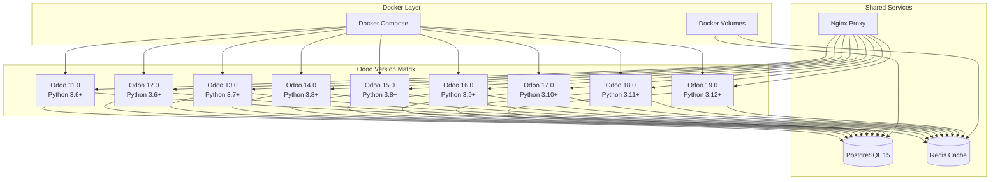

# MyTriv ERP Multi-Version Setup Guide

## Overview

This guide provides comprehensive instructions for setting up MyTriv ERP with different Odoo versions using Docker. MyTriv ERP supports **Odoo 11 through Odoo 19**, allowing you to run multiple versions simultaneously for testing, migration, and production environments.

## 🚀 Quick Start by Version

### Default Setup (Odoo 17)

```bash
# Uses Odoo 17.0 by default
curl -fsSL https://raw.githubusercontent.com/fxagro/mytriv-erp/main/setup_mytriv_erp.sh | bash
```

### Specific Version Setup

```bash
# Set environment variable for specific version
export ODOO_VERSION=16.0
curl -fsSL https://raw.githubusercontent.com/fxagro/mytriv-erp/main/setup_mytriv_erp.sh | bash

# Or use command line argument
ODOO_VERSION=15.0 curl -fsSL https://raw.githubusercontent.com/fxagro/mytriv-erp/main/setup_mytriv_erp.sh | bash
```

### Manual Docker Build

```bash
# Build specific Odoo version
docker build --build-arg ODOO_VERSION=14.0 -t mytriv-erp:v14 .

# Run container
docker run -d -p 8069:8069 --name mytriv-odoo14 mytriv-erp:v14
```

## 🏗️ Architecture Overview

### Multi-Version Architecture



## ⚙️ Version-Specific Setup

### Odoo 11.0 Setup

```bash
# Build Odoo 11
docker build --build-arg ODOO_VERSION=11.0 -t mytriv-erp:v11 .

# Run with specific configuration
docker run -d \
  --name mytriv-odoo11 \
  -p 8011:8069 \
  -e ODOO_VERSION=11.0 \
  -e POSTGRES_HOST=localhost \
  -e POSTGRES_DB=mytriv_erp_v11 \
  mytriv-erp:v11
```

**Access:** http://localhost:8011

### Odoo 12.0 Setup

```bash
# Build Odoo 12
docker build --build-arg ODOO_VERSION=12.0 -t mytriv-erp:v12 .

# Run with specific configuration
docker run -d \
  --name mytriv-odoo12 \
  -p 8012:8069 \
  -e ODOO_VERSION=12.0 \
  -e POSTGRES_DB=mytriv_erp_v12 \
  mytriv-erp:v12
```

**Access:** http://localhost:8012

### Odoo 13.0 Setup

```bash
# Build Odoo 13
docker build --build-arg ODOO_VERSION=13.0 -t mytriv-erp:v13 .

# Run with specific configuration
docker run -d \
  --name mytriv-odoo13 \
  -p 8013:8069 \
  -e ODOO_VERSION=13.0 \
  -e POSTGRES_DB=mytriv_erp_v13 \
  mytriv-erp:v13
```

**Access:** http://localhost:8013

### Odoo 14.0 Setup

```bash
# Build Odoo 14
docker build --build-arg ODOO_VERSION=14.0 -t mytriv-erp:v14 .

# Run with specific configuration
docker run -d \
  --name mytriv-odoo14 \
  -p 8014:8069 \
  -e ODOO_VERSION=14.0 \
  -e POSTGRES_DB=mytriv_erp_v14 \
  mytriv-erp:v14
```

**Access:** http://localhost:8014

### Odoo 15.0 Setup

```bash
# Build Odoo 15
docker build --build-arg ODOO_VERSION=15.0 -t mytriv-erp:v15 .

# Run with specific configuration
docker run -d \
  --name mytriv-odoo15 \
  -p 8015:8069 \
  -e ODOO_VERSION=15.0 \
  -e POSTGRES_DB=mytriv_erp_v15 \
  mytriv-erp:v15
```

**Access:** http://localhost:8015

### Odoo 16.0 Setup

```bash
# Build Odoo 16
docker build --build-arg ODOO_VERSION=16.0 -t mytriv-erp:v16 .

# Run with specific configuration
docker run -d \
  --name mytriv-odoo16 \
  -p 8016:8069 \
  -e ODOO_VERSION=16.0 \
  -e POSTGRES_DB=mytriv_erp_v16 \
  mytriv-erp:v16
```

**Access:** http://localhost:8016

### Odoo 17.0 Setup (Default)

```bash
# Build Odoo 17 (default)
docker build --build-arg ODOO_VERSION=17.0 -t mytriv-erp:v17 .

# Run with specific configuration
docker run -d \
  --name mytriv-odoo17 \
  -p 8069:8069 \
  -e ODOO_VERSION=17.0 \
  -e POSTGRES_DB=mytriv_erp_v17 \
  mytriv-erp:v17
```

**Access:** http://localhost:8069

### Odoo 18.0 Setup

```bash
# Build Odoo 18
docker build --build-arg ODOO_VERSION=18.0 -t mytriv-erp:v18 .

# Run with specific configuration
docker run -d \
  --name mytriv-odoo18 \
  -p 8018:8069 \
  -e ODOO_VERSION=18.0 \
  -e POSTGRES_DB=mytriv_erp_v18 \
  mytriv-erp:v18
```

**Access:** http://localhost:8018

### Odoo 19.0 Setup

```bash
# Build Odoo 19
docker build --build-arg ODOO_VERSION=19.0 -t mytriv-erp:v19 .

# Run with specific configuration
docker run -d \
  --name mytriv-odoo19 \
  -p 8019:8069 \
  -e ODOO_VERSION=19.0 \
  -e POSTGRES_DB=mytriv_erp_v19 \
  mytriv-erp:v19
```

**Access:** http://localhost:8019

## 🐳 Multi-Version Docker Compose

### Complete Multi-Version Setup

```yaml
# docker-compose.multi-version.yml
version: '3.8'
services:
  # PostgreSQL Database
  db:
    image: postgres:15
    environment:
      POSTGRES_USER: odoo
      POSTGRES_PASSWORD: ${POSTGRES_PASSWORD:-mytriv_secure_password}
      POSTGRES_DB: postgres
    volumes:
      - postgres_data:/var/lib/postgresql/data
    ports:
      - "5432:5432"
    healthcheck:
      test: ["CMD-SHELL", "pg_isready -U odoo -d postgres"]
      interval: 30s
      timeout: 10s
      retries: 3

  # Redis Cache
  redis:
    image: redis:7-alpine
    ports:
      - "6379:6379"
    volumes:
      - redis_data:/data
    healthcheck:
      test: ["CMD", "redis-cli", "ping"]
      interval: 30s
      timeout: 10s
      retries: 3

  # Nginx Reverse Proxy
  nginx:
    image: nginx:alpine
    ports:
      - "80:80"
      - "443:443"
    volumes:
      - ./nginx.conf:/etc/nginx/nginx.conf:ro
      - ./ssl:/etc/nginx/ssl:ro
    depends_on:
      - odoo11
      - odoo12
      - odoo13
      - odoo14
      - odoo15
      - odoo16
      - odoo17
      - odoo18
      - odoo19
    restart: always

  # Odoo 11 Instance
  odoo11:
    build:
      context: .
      dockerfile: backend/Dockerfile
      args:
        ODOO_VERSION: 11.0
    environment:
      POSTGRES_HOST: db
      POSTGRES_DB: mytriv_erp_v11
      POSTGRES_USER: odoo
      POSTGRES_PASSWORD: ${POSTGRES_PASSWORD:-mytriv_secure_password}
    volumes:
      - odoo11_data:/var/lib/odoo
      - ./backend/addons:/mnt/extra-addons
    depends_on:
      db:
        condition: service_healthy
      redis:
        condition: service_healthy
    ports:
      - "8011:8069"
    restart: always

  # Odoo 12 Instance
  odoo12:
    build:
      context: .
      dockerfile: backend/Dockerfile
      args:
        ODOO_VERSION: 12.0
    environment:
      POSTGRES_HOST: db
      POSTGRES_DB: mytriv_erp_v12
      POSTGRES_USER: odoo
      POSTGRES_PASSWORD: ${POSTGRES_PASSWORD:-mytriv_secure_password}
    volumes:
      - odoo12_data:/var/lib/odoo
      - ./backend/addons:/mnt/extra-addons
    depends_on:
      db:
        condition: service_healthy
      redis:
        condition: service_healthy
    ports:
      - "8012:8069"
    restart: always

  # Odoo 13 Instance
  odoo13:
    build:
      context: .
      dockerfile: backend/Dockerfile
      args:
        ODOO_VERSION: 13.0
    environment:
      POSTGRES_HOST: db
      POSTGRES_DB: mytriv_erp_v13
      POSTGRES_USER: odoo
      POSTGRES_PASSWORD: ${POSTGRES_PASSWORD:-mytriv_secure_password}
    volumes:
      - odoo13_data:/var/lib/odoo
      - ./backend/addons:/mnt/extra-addons
    depends_on:
      db:
        condition: service_healthy
      redis:
        condition: service_healthy
    ports:
      - "8013:8069"
    restart: always

  # Odoo 14 Instance
  odoo14:
    build:
      context: .
      dockerfile: backend/Dockerfile
      args:
        ODOO_VERSION: 14.0
    environment:
      POSTGRES_HOST: db
      POSTGRES_DB: mytriv_erp_v14
      POSTGRES_USER: odoo
      POSTGRES_PASSWORD: ${POSTGRES_PASSWORD:-mytriv_secure_password}
    volumes:
      - odoo14_data:/var/lib/odoo
      - ./backend/addons:/mnt/extra-addons
    depends_on:
      db:
        condition: service_healthy
      redis:
        condition: service_healthy
    ports:
      - "8014:8069"
    restart: always

  # Odoo 15 Instance
  odoo15:
    build:
      context: .
      dockerfile: backend/Dockerfile
      args:
        ODOO_VERSION: 15.0
    environment:
      POSTGRES_HOST: db
      POSTGRES_DB: mytriv_erp_v15
      POSTGRES_USER: odoo
      POSTGRES_PASSWORD: ${POSTGRES_PASSWORD:-mytriv_secure_password}
    volumes:
      - odoo15_data:/var/lib/odoo
      - ./backend/addons:/mnt/extra-addons
    depends_on:
      db:
        condition: service_healthy
      redis:
        condition: service_healthy
    ports:
      - "8015:8069"
    restart: always

  # Odoo 16 Instance
  odoo16:
    build:
      context: .
      dockerfile: backend/Dockerfile
      args:
        ODOO_VERSION: 16.0
    environment:
      POSTGRES_HOST: db
      POSTGRES_DB: mytriv_erp_v16
      POSTGRES_USER: odoo
      POSTGRES_PASSWORD: ${POSTGRES_PASSWORD:-mytriv_secure_password}
    volumes:
      - odoo16_data:/var/lib/odoo
      - ./backend/addons:/mnt/extra-addons
    depends_on:
      db:
        condition: service_healthy
      redis:
        condition: service_healthy
    ports:
      - "8016:8069"
    restart: always

  # Odoo 17 Instance (Default)
  odoo17:
    build:
      context: .
      dockerfile: backend/Dockerfile
      args:
        ODOO_VERSION: 17.0
    environment:
      POSTGRES_HOST: db
      POSTGRES_DB: mytriv_erp_v17
      POSTGRES_USER: odoo
      POSTGRES_PASSWORD: ${POSTGRES_PASSWORD:-mytriv_secure_password}
    volumes:
      - odoo17_data:/var/lib/odoo
      - ./backend/addons:/mnt/extra-addons
    depends_on:
      db:
        condition: service_healthy
      redis:
        condition: service_healthy
    ports:
      - "8069:8069"
    restart: always

  # Odoo 18 Instance
  odoo18:
    build:
      context: .
      dockerfile: backend/Dockerfile
      args:
        ODOO_VERSION: 18.0
    environment:
      POSTGRES_HOST: db
      POSTGRES_DB: mytriv_erp_v18
      POSTGRES_USER: odoo
      POSTGRES_PASSWORD: ${POSTGRES_PASSWORD:-mytriv_secure_password}
    volumes:
      - odoo18_data:/var/lib/odoo
      - ./backend/addons:/mnt/extra-addons
    depends_on:
      db:
        condition: service_healthy
      redis:
        condition: service_healthy
    ports:
      - "8018:8069"
    restart: always

  # Odoo 19 Instance
  odoo19:
    build:
      context: .
      dockerfile: backend/Dockerfile
      args:
        ODOO_VERSION: 19.0
    environment:
      POSTGRES_HOST: db
      POSTGRES_DB: mytriv_erp_v19
      POSTGRES_USER: odoo
      POSTGRES_PASSWORD: ${POSTGRES_PASSWORD:-mytriv_secure_password}
    volumes:
      - odoo19_data:/var/lib/odoo
      - ./backend/addons:/mnt/extra-addons
    depends_on:
      db:
        condition: service_healthy
      redis:
        condition: service_healthy
    ports:
      - "8019:8069"
    restart: always

  # Frontend (Universal)
  frontend:
    build:
      context: ./frontend
      dockerfile: Dockerfile
    environment:
      NEXT_PUBLIC_API_URL: http://localhost:8069/api
    ports:
      - "3000:3000"
    depends_on:
      - odoo17  # Default backend
    restart: always

volumes:
  postgres_data:
  redis_data:
  odoo11_data:
  odoo12_data:
  odoo13_data:
  odoo14_data:
  odoo15_data:
  odoo16_data:
  odoo17_data:
  odoo18_data:
  odoo19_data:
```

### Nginx Configuration for Multi-Version

```nginx
# nginx.conf
events {
    worker_connections 1024;
}

http {
    upstream odoo_backend {
        # Load balancing across versions
        server odoo11:8069;
        server odoo12:8069;
        server odoo13:8069;
        server odoo14:8069;
        server odoo15:8069;
        server odoo16:8069;
        server odoo17:8069 weight=3;  # Higher weight for default
        server odoo18:8069;
        server odoo19:8069;
    }

    server {
        listen 80;
        server_name _;

        # Frontend
        location / {
            proxy_pass http://frontend:3000;
            proxy_set_header Host $host;
            proxy_set_header X-Real-IP $remote_addr;
            proxy_set_header X-Forwarded-For $proxy_add_x_forwarded_for;
            proxy_set_header X-Forwarded-Proto $scheme;
        }

        # API routing by version
        location ~ ^/api/(v[0-9]+)/(.*) {
            proxy_pass http://odoo_backend/api/$1/$2;
            proxy_set_header Host $host;
            proxy_set_header X-Real-IP $remote_addr;
            proxy_set_header X-Forwarded-For $proxy_add_x_forwarded_for;
            proxy_set_header X-Forwarded-Proto $scheme;
        }

        # Default API (uses Odoo 17)
        location /api/ {
            proxy_pass http://odoo17:8069/api/;
            proxy_set_header Host $host;
            proxy_set_header X-Real-IP $remote_addr;
            proxy_set_header X-Forwarded-For $proxy_add_x_forwarded_for;
            proxy_set_header X-Forwarded-Proto $scheme;
        }

        # Version-specific routing
        location /odoo11/ {
            proxy_pass http://odoo11:8069/;
            proxy_set_header Host $host;
            proxy_set_header X-Real-IP $remote_addr;
            proxy_set_header X-Forwarded-For $proxy_add_x_forwarded_for;
            proxy_set_header X-Forwarded-Proto $scheme;
        }

        location /odoo12/ {
            proxy_pass http://odoo12:8069/;
            proxy_set_header Host $host;
            proxy_set_header X-Real-IP $remote_addr;
            proxy_set_header X-Forwarded-For $proxy_add_x_forwarded_for;
            proxy_set_header X-Forwarded-Proto $scheme;
        }

        # Add similar blocks for odoo13 through odoo19
    }
}
```

## 🚀 Deployment Commands

### Start All Versions

```bash
# Start complete multi-version stack
docker-compose -f docker-compose.multi-version.yml up -d

# Check status
docker-compose -f docker-compose.multi-version.yml ps
```

### Version-Specific Commands

```bash
# Start specific version
docker-compose -f docker-compose.multi-version.yml up -d odoo16

# Stop specific version
docker-compose -f docker-compose.multi-version.yml stop odoo16

# View logs for specific version
docker-compose -f docker-compose.multi-version.yml logs -f odoo16

# Restart specific version
docker-compose -f docker-compose.multi-version.yml restart odoo16
```

### Database Management

```bash
# Create databases for each version
docker-compose -f docker-compose.multi-version.yml exec db psql -U odoo -d postgres -c "CREATE DATABASE mytriv_erp_v11;"
docker-compose -f docker-compose.multi-version.yml exec db psql -U odoo -d postgres -c "CREATE DATABASE mytriv_erp_v12;"
# ... continue for all versions

# Backup all version databases
for version in 11 12 13 14 15 16 17 18 19; do
    docker-compose -f docker-compose.multi-version.yml exec db pg_dump -U odoo mytriv_erp_v${version} > backup_v${version}_$(date +%Y%m%d).sql
done
```

## 🔧 Environment Configuration

### Version-Specific Environment Files

```bash
# Create environment files for each version
for version in 11 12 13 14 15 16 17 18 19; do
    cp .env.example .env.v${version}
    echo "ODOO_VERSION=${version}.0" >> .env.v${version}
    echo "POSTGRES_DB=mytriv_erp_v${version}" >> .env.v${version}
    echo "COMPOSE_PROJECT_NAME=mytriv_erp_v${version}" >> .env.v${version}
done
```

### Frontend Configuration for Multi-Version

```typescript
// lib/config.ts
export const odooVersions = [
  { version: '11.0', url: 'http://localhost:8011/api' },
  { version: '12.0', url: 'http://localhost:8012/api' },
  { version: '13.0', url: 'http://localhost:8013/api' },
  { version: '14.0', url: 'http://localhost:8014/api' },
  { version: '15.0', url: 'http://localhost:8015/api' },
  { version: '16.0', url: 'http://localhost:8016/api' },
  { version: '17.0', url: 'http://localhost:8069/api' },
  { version: '18.0', url: 'http://localhost:8018/api' },
  { version: '19.0', url: 'http://localhost:8019/api' },
];

export const defaultVersion = odooVersions.find(v => v.version === '17.0');
```

## 🧪 Testing Multi-Version Setup

### Health Checks

```bash
# Test all versions
for port in 8011 8012 8013 8014 8015 8016 8069 8018 8019; do
    echo "Testing port $port..."
    curl -f http://localhost:$port/api/models || echo "Failed on port $port"
done

# Test API endpoints for each version
for version in 11 12 13 14 15 16 17 18 19; do
    port=$([ "$version" = "17" ] && echo "8069" || echo "80${version}")
    echo "Testing Odoo $version on port $port..."
    curl -s http://localhost:$port/api/models | head -20
done
```

### Load Testing

```bash
# Install siege for load testing
sudo apt-get install siege

# Test each version under load
for version in 11 12 13 14 15 16 17 18 19; do
    port=$([ "$version" = "17" ] && echo "8069" || echo "80${version}")
    echo "Load testing Odoo $version..."
    siege -c 10 -t 30S http://localhost:$port/api/models/hr.employee
done
```

## 🔍 Troubleshooting

### Common Issues

#### Port Conflicts
```bash
# Check port usage
netstat -tulpn | grep :80

# Kill conflicting processes
sudo fuser -k 80/tcp

# Or use different ports
docker run -p 8080:8069 mytriv-erp:v17
```

#### Database Connection Issues
```bash
# Test database connectivity
docker-compose exec db pg_isready -U odoo

# Check database exists
docker-compose exec db psql -U odoo -l | grep mytriv

# Create missing database
docker-compose exec db createdb -U odoo mytriv_erp_v17
```

#### Module Loading Issues
```bash
# Check Odoo logs
docker-compose logs odoo17 | grep -i error

# Verify module structure
docker-compose exec odoo17 ls -la /mnt/extra-addons/

# Test module installation
docker-compose exec odoo17 python -c "
import sys
sys.path.append('/mnt/extra-addons')
import base_rest_api
print('Module loaded successfully')
"
```

### Version-Specific Debugging

```bash
# Enable debug mode for specific version
docker run -e ODOO_DEBUG=1 -p 8020:8069 mytriv-erp:v17

# Access Odoo shell for debugging
docker-compose exec odoo17 python -c "
from odoo.api import Environment
env = Environment(self.env.cr, self.env.uid, self.env.context)
print('Current database:', env.cr.dbname)
print('Available models:', len(env['ir.model'].search([])))
"
```

## 📊 Performance Optimization

### Memory Management

```yaml
# Optimized memory limits per version
services:
  odoo17:
    deploy:
      resources:
        limits:
          memory: 2G
        reservations:
          memory: 1G
```

### Database Optimization

```sql
-- Create indexes for better performance across versions
-- Run in each version database

-- Employee indexes
CREATE INDEX IF NOT EXISTS idx_hr_employee_active ON hr_employee(active);
CREATE INDEX IF NOT EXISTS idx_hr_employee_department ON hr_employee(department_id);
CREATE INDEX IF NOT EXISTS idx_hr_employee_create_date ON hr_employee(create_date);

-- CRM indexes
CREATE INDEX IF NOT EXISTS idx_crm_lead_stage ON crm_lead(stage_id);
CREATE INDEX IF NOT EXISTS idx_crm_lead_user ON crm_lead(user_id);
CREATE INDEX IF NOT EXISTS idx_crm_lead_priority ON crm_lead(priority);

-- Account indexes
CREATE INDEX IF NOT EXISTS idx_account_move_date ON account_move(date);
CREATE INDEX IF NOT EXISTS idx_account_move_state ON account_move(state);
CREATE INDEX IF NOT EXISTS idx_account_move_partner ON account_move(partner_id);
```

## 🔒 Security Considerations

### Version Isolation
- Each Odoo version runs in isolated containers
- Separate databases for each version
- Independent user sessions per version

### Network Security
```bash
# Restrict container communication
docker network create --internal backend_network

# Run databases on internal network only
services:
  db:
    networks:
      - backend_network
```

### Access Control
```nginx
# Restrict access to specific IPs
location /api/ {
    allow 192.168.1.0/24;
    allow 10.0.0.0/8;
    deny all;
    proxy_pass http://odoo_backend;
}
```

## 📈 Monitoring and Maintenance

### Health Monitoring

```bash
# Monitor all versions
watch -n 5 'for port in 8011 8012 8013 8014 8015 8016 8069 8018 8019; do
    echo "=== Port $port ==="
    curl -s -w "Status: %{http_code}\n" http://localhost:$port/api/models | head -5
done'

# Docker stats for all versions
docker stats $(docker-compose -f docker-compose.multi-version.yml ps -q)
```

### Log Management

```bash
# Centralized logging
docker-compose -f docker-compose.multi-version.yml logs -f odoo17 > logs/odoo17.log &
docker-compose -f docker-compose.multi-version.yml logs -f odoo18 > logs/odoo18.log &
# ... for all versions

# Log rotation
find logs/ -name "*.log" -exec gzip {} \;
```

## 🚀 Production Deployment

### Scaling Strategy

```yaml
# Horizontal scaling for production
services:
  odoo17:
    scale: 3
    deploy:
      resources:
        limits:
          memory: 4G
        reservations:
          memory: 2G
```

### Backup Strategy

```bash
#!/bin/bash
# backup-multi-version.sh

BACKUP_DIR="./backups/$(date +%Y%m%d)"
mkdir -p $BACKUP_DIR

# Backup all databases
for version in 11 12 13 14 15 16 17 18 19; do
    echo "Backing up version $version..."
    docker-compose -f docker-compose.multi-version.yml exec -T db \
        pg_dump -U odoo mytriv_erp_v${version} | \
        gzip > $BACKUP_DIR/db_v${version}_$(date +%H%M%S).sql.gz
done

# Backup Docker volumes
for version in 11 12 13 14 15 16 17 18 19; do
    docker run --rm -v mytriv_erp_odoo${version}_data:/data \
        -v $(pwd)/backups:/backup alpine tar czf \
        /backup/odoo${version}_data_$(date +%Y%m%d_%H%M%S).tar.gz -C /data ./
done

echo "Backup completed: $(ls -la $BACKUP_DIR/)"
```

## 📚 Additional Resources

- **[Multi-Version Guide](MULTI_VERSION_GUIDE.md)**: Detailed version matrix and migration strategies
- **[Deployment Guide](DEPLOYMENT.md)**: Production deployment and CI/CD
- **[API Documentation](API_DOCUMENTATION.md)**: Complete API reference
- **[Architecture Guide](ARCHITECTURE.md)**: System architecture overview

## 🤝 Support

For setup and configuration issues:
- Check the troubleshooting section above
- Review Docker and Odoo logs for errors
- Test with a single version first before multi-version setup
- Join community discussions for additional help

---

**MyTriv ERP Setup Guide** • Multi-Version Docker Deployment