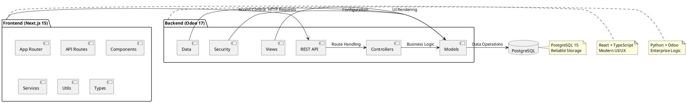
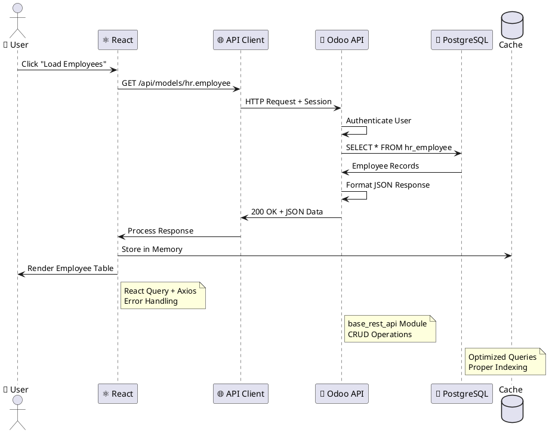
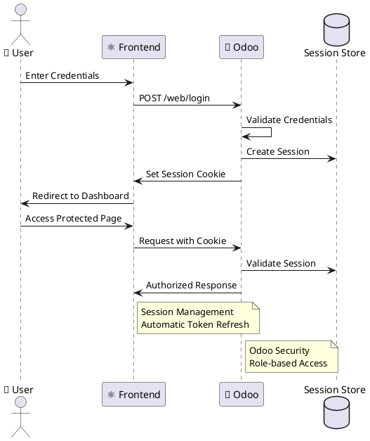
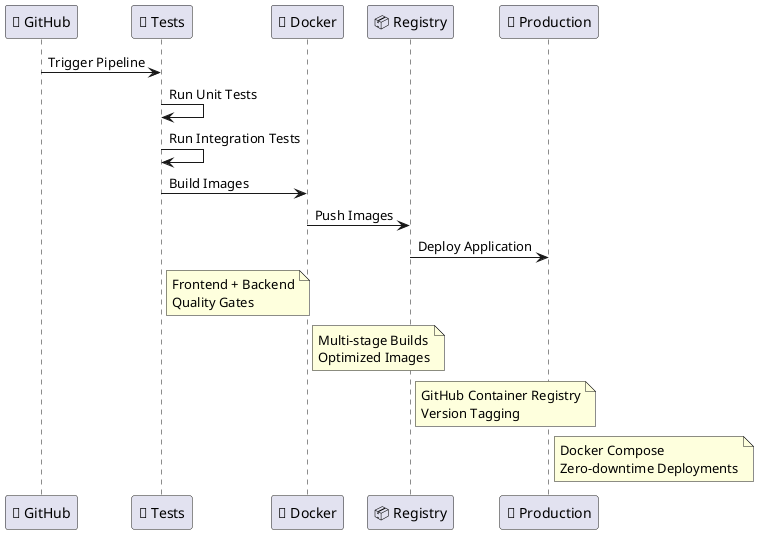

# MyTriv ERP Architecture

## Overview

MyTriv ERP is a full-stack enterprise resource planning system that combines the power of Odoo 17 (backend) with a modern React frontend using Next.js 15. This architecture provides a scalable, maintainable, and user-friendly ERP solution for multi-industry use cases.

## 🏗️ System Architecture

### **High-Level Architecture Diagram**

```plantuml
@startuml MyTriv_ERP_Architecture
!define AWSPUML https://raw.githubusercontent.com/awslabs/aws-icons-for-plantuml/v19.0/dist
!include AWSPUML/AWSCommon.puml
!include AWSPUML/InternetOfThings/IoTCore.puml
!include AWSPUML/ApplicationIntegration/SimpleQueueService.puml

actor "👤 Users" as Users
package "🌐 Internet" as Internet

package "🚀 MyTriv ERP Platform" as Platform {
    package "⚛️ React Frontend" as Frontend {
        component [Next.js 15] as NextJS
        component [shadcn/ui] as Shadcn
        component [API Client] as APIClient
        database "Browser Storage" as BrowserDB
    }

    package "🔧 Odoo Backend" as Backend {
        component [base_rest_api] as RESTAPI
        component [Controllers] as Controllers
        component [Models] as Models
        database "Odoo Modules" as OdooModules
    }

    database "🐘 PostgreSQL" as PostgreSQL
}

Users --> Internet
Internet --> Frontend
Frontend --> Backend : REST API
Backend --> PostgreSQL : SQL Queries
Frontend --> BrowserDB : Local Cache

note right of Frontend : Next.js 15 + TypeScript\nTailwindCSS + shadcn/ui
note right of Backend : Odoo 17 + Python\nCustom REST Module
note right of PostgreSQL : Enterprise Database\nACID Compliant

@enduml
```

### **Detailed Component Architecture**



## Technology Stack

### Frontend
- **Framework**: Next.js 15 (React 18)
- **Language**: TypeScript
- **Styling**: TailwindCSS
- **UI Components**: shadcn/ui (Radix UI + TailwindCSS)
- **HTTP Client**: Axios
- **State Management**: React Query (TanStack Query)

### Backend
- **ERP Framework**: Odoo 17 Community Edition
- **Language**: Python 3.11+
- **Database**: PostgreSQL 15
- **Web Server**: Werkzeug (Odoo built-in)
- **REST API**: Custom base_rest_api module

### DevOps & Infrastructure
- **Containerization**: Docker & Docker Compose
- **CI/CD**: GitHub Actions
- **Version Control**: Git & GitHub
- **Package Management**:
  - Frontend: npm
  - Backend: pip (Python)

## Component Architecture

### Frontend Architecture

#### Pages Structure
```
src/
├── app/                    # Next.js 13+ App Router
│   ├── api/               # API routes (if needed)
│   ├── dashboard/         # Main dashboard pages
│   ├── employees/         # Employee management
│   ├── globals.css        # Global styles
│   ├── layout.tsx         # Root layout
│   └── page.tsx           # Home page
├── components/            # Reusable UI components
│   ├── ui/               # shadcn/ui components
│   └── forms/            # Form components
└── lib/                  # Utility functions
    └── utils.ts          # Helper functions
```

#### API Layer
- **API Client**: Centralized HTTP client configuration
- **Models**: TypeScript interfaces for API responses
- **Hooks**: Custom React hooks for data fetching
- **Error Handling**: Centralized error handling and user feedback

### Backend Architecture

#### Odoo Module Structure
```
addons/
└── base_rest_api/
    ├── __init__.py           # Module initialization
    ├── __manifest__.py       # Module manifest
    ├── controllers/          # HTTP controllers
    │   ├── __init__.py
    │   └── main.py          # REST API endpoints
    ├── models/              # Odoo models
    │   └── __init__.py
    └── security/            # Access rights
        └── ir.model.access.csv
```

#### REST API Endpoints
- `GET /api/models` - List available models
- `GET /api/models/{model}` - Get records from model
- `GET /api/models/{model}/{id}` - Get specific record
- `POST /api/models/{model}` - Create new record
- `PUT /api/models/{model}/{id}` - Update record
- `DELETE /api/models/{model}/{id}` - Delete record

## 📊 Data Flow

### **Employee API Request Flow**



### **Authentication Flow**



### **CI/CD Pipeline Flow**



## Deployment Architecture

### Development Environment
- **Local Development**: Docker Compose for all services
- **Hot Reload**: Next.js development server with file watching
- **Debugging**: Odoo debug mode enabled

### Production Environment
- **Containerized**: All services run in Docker containers
- **Load Balancing**: Reverse proxy for production traffic
- **Database**: Separate PostgreSQL instance
- **Monitoring**: Health checks and logging

## Security Considerations

### API Security
- **CORS**: Properly configured cross-origin policies
- **Authentication**: Session-based authentication via Odoo
- **Authorization**: Model-level access control
- **Rate Limiting**: Basic rate limiting on API endpoints

### Data Security
- **Database**: PostgreSQL with proper user permissions
- **Environment Variables**: Sensitive data in environment variables
- **HTTPS**: SSL/TLS encryption in production

## Scalability Considerations

### Horizontal Scaling
- **Frontend**: Next.js can be deployed on multiple instances
- **Backend**: Odoo supports load balancing
- **Database**: PostgreSQL can be scaled with read replicas

### Performance Optimization
- **Caching**: Redis for session storage and caching
- **CDN**: Static assets served via CDN
- **Database Indexing**: Proper database indexes for query performance

## Development Guidelines

### Code Organization
- **Separation of Concerns**: Clear separation between UI, API, and business logic
- **Component Reusability**: Reusable components across the application
- **API Consistency**: Consistent API response formats

### Best Practices
- **TypeScript**: Strict typing for better code quality
- **Error Handling**: Comprehensive error handling and user feedback
- **Testing**: Unit and integration tests for critical functionality
- **Documentation**: Well-documented code and API endpoints